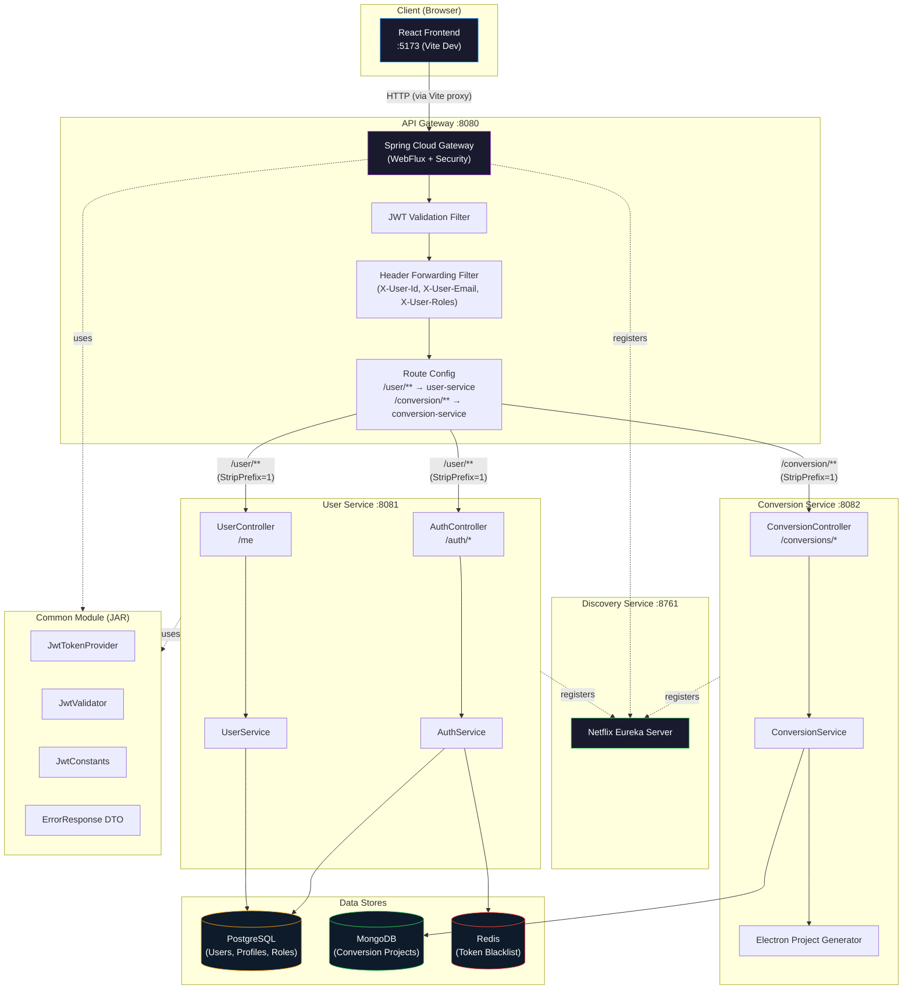
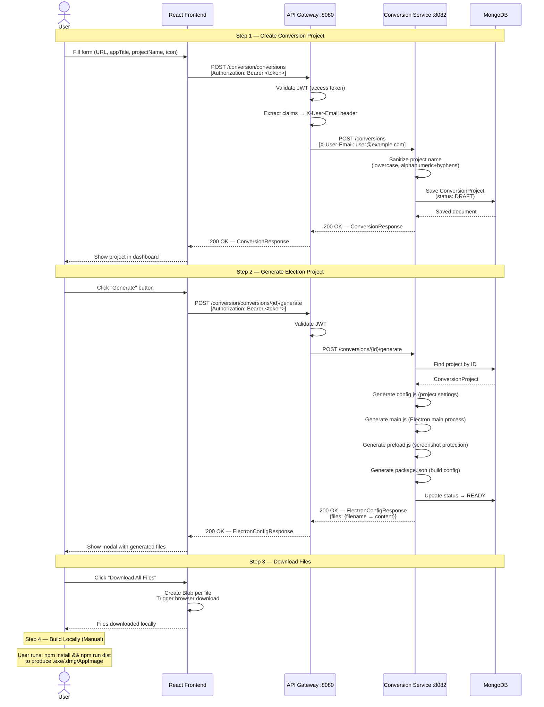
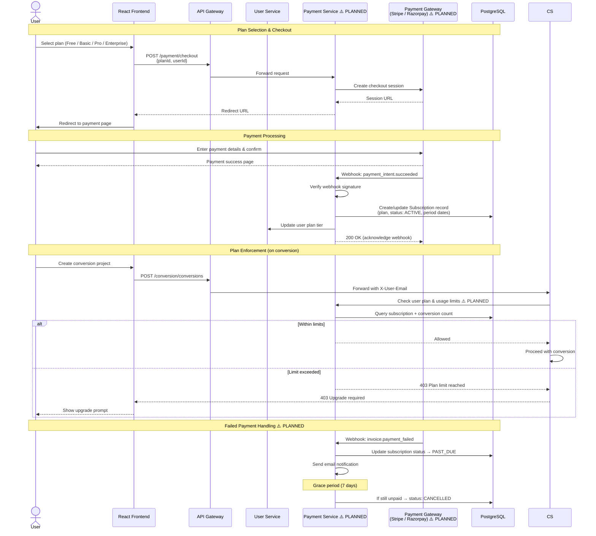
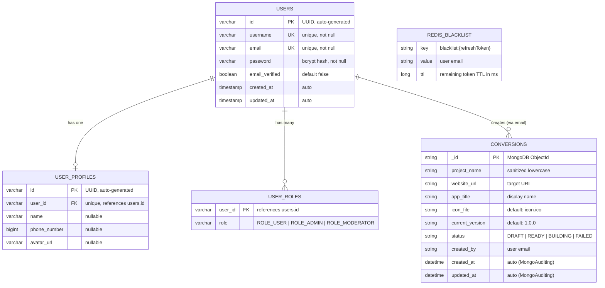
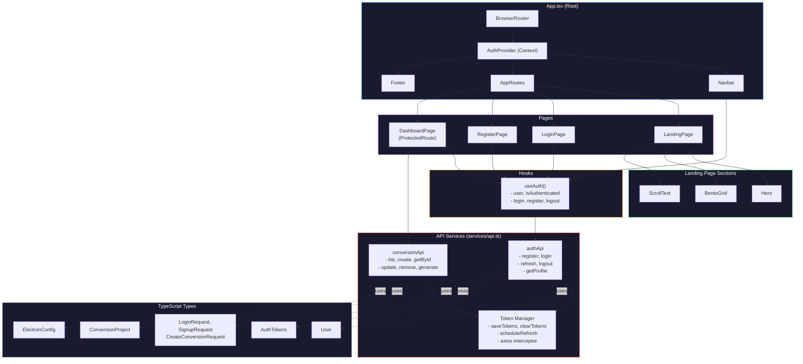

# WebToDesk — Architecture Documentation

This document describes the system architecture of WebToDesk, including service topology, data flows, database schema relationships, and frontend component structure.

---

## Table of Contents

1. [System Architecture Diagram](#1-system-architecture-diagram)
2. [Sequence Diagram — Website Conversion Flow](#2-sequence-diagram--website-conversion-flow)
3. [Sequence Diagram — Subscription & Payment Flow](#3-sequence-diagram--subscription--payment-flow)
4. [Entity Relationship Diagram (ERD)](#4-entity-relationship-diagram-erd)
5. [Component Diagram — Frontend](#5-component-diagram--frontend)

---

## 1. System Architecture Diagram

Shows all services, databases, queues, external APIs, and the client with data flow arrows.

### Service Ports

| Service | Port | Technology |
|---------|------|-----------|
| Frontend (Vite dev server) | 5173 | React + Vite |
| API Gateway | 8080 | Spring Cloud Gateway (WebFlux) |
| User Service | 8081 | Spring Boot (Servlet) |
| Conversion Service | 8082 | Spring Boot (Servlet) |
| Discovery Service | 8761 | Eureka Server |

### Key Architectural Decisions

- **Gateway-only auth**: The API Gateway performs all JWT validation. Downstream services (user-service, conversion-service) trust the gateway and permit all requests internally, relying on forwarded `X-User-*` headers for identity.
- **Shared common module**: JWT logic (provider, validator, constants) is in a `common` Maven module used by both the gateway and user-service.
- **Stateless sessions**: No server-side session storage. JWTs are validated per-request. Refresh token blacklisting uses Redis with TTL matching token expiry.
- **Service discovery**: Eureka enables load-balanced routing (`lb://service-name`) through the gateway without hardcoded service URLs.

---

## 2. Sequence Diagram — Website Conversion Flow

End-to-end flow from user submitting a URL to downloading the generated Electron project files.

### ⚠️ Missing: Server-Side Build Pipeline

The current implementation **does not build the .exe on the server**. It returns Electron source files as JSON, and the user must:

1. Download the files
2. Add an `icon.ico` to a `build/` folder
3. Run `npm install` and `npm run dist` locally with Electron Builder

A server-side build pipeline (job queue → cloud builder → upload to storage → notify user) is planned but not implemented.

---

## 3. Sequence Diagram — Subscription & Payment Flow

> ⚠️ **NOT YET IMPLEMENTED** — This diagram represents the **planned** architecture.

### Planned Subscription Tiers

| Plan | Conversions/Month | Server Builds | Custom Icons | Price |
|------|-------------------|---------------|-------------|-------|
| Free | 2 | No | No | $0 |
| Basic | 10 | Yes | Yes | $9/mo |
| Pro | 50 | Yes | Yes | $29/mo |
| Enterprise | Unlimited | Yes | Yes | Custom |

---

## 4. Entity Relationship Diagram (ERD)

### Database Distribution

| Entity | Database | Engine |
|--------|----------|--------|
| `users`, `user_profiles`, `user_roles` | PostgreSQL (Neon) | JPA/Hibernate |
| `conversions` (collection) | MongoDB (Atlas) | Spring Data MongoDB |
| `blacklist:*` (keys) | Redis (Upstash) | Spring Data Redis |

---

## 5. Component Diagram — Frontend

### Frontend Architecture Notes

- **State Management**: React Context API via `AuthProvider` — no Redux/Zustand. Auth state (user, tokens) is the only global state.
- **Routing**: React Router v7 with a `ProtectedRoute` wrapper that redirects unauthenticated users to `/login`.
- **Token Refresh**: Automatic silent refresh scheduled 60 seconds before access token expiry. On failure, clears tokens and redirects to login.
- **API Layer**: Centralized Axios instance with request interceptor for JWT attachment. Vite dev server proxies `/user/*` and `/conversion/*` to the gateway at `:8080`.
- **Styling**: TailwindCSS with custom design tokens (glass morphism, gradients, custom colors). Dark-only theme with Apple-inspired aesthetic.
- **Animations**: Framer Motion for page transitions, scroll-linked text reveal, and micro-interactions.
