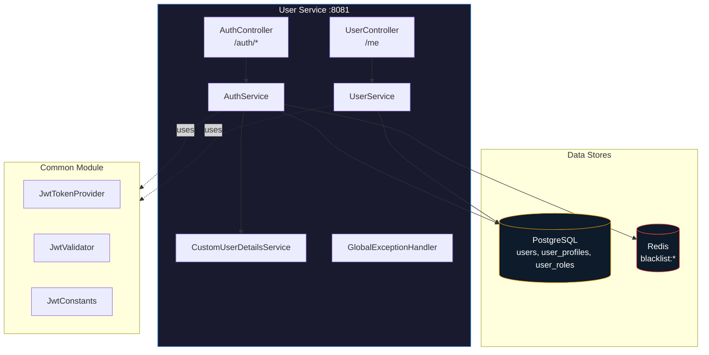
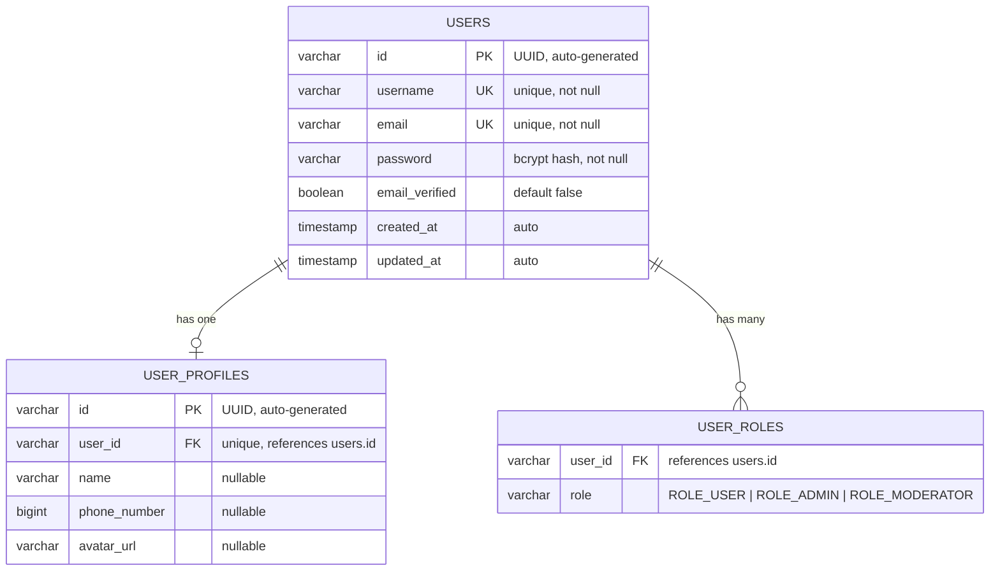
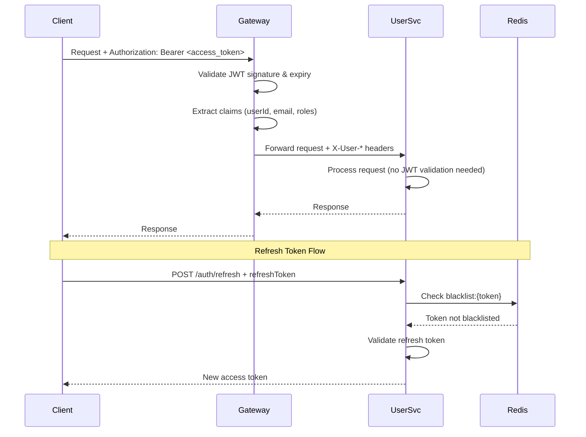

# WEBTODESK USER SERVICE
### Complete Reference Guide · Authentication · User Management · Security · Integration

| | |
|---|---|
| **Service Type** | Spring Boot Microservice (User Management & Authentication) |
| **Core Runtime** | Spring Boot 3.x + Spring Security + JWT |
| **Target Database** | PostgreSQL 15+ (Users) + Redis 7+ (Token Blacklist) |
| **Language** | Java 17 |
| **Framework** | Spring Boot Web (Servlet) + Spring Data JPA |
| **Authentication** | JWT (Access + Refresh tokens) |
| **Document** | March 2026 — Complete Service Reference |

---

## 01 Executive Summary

The User Service is the authentication and user management backbone of the WebToDesk platform. It handles user registration, login, profile management, and JWT token lifecycle management. The service integrates with the API Gateway for security validation and forwards user context to downstream services via HTTP headers.

**Core Responsibilities:**
- User registration and authentication with JWT tokens
- Profile management (username, name, phone, avatar)
- Secure password hashing with BCrypt
- Refresh token lifecycle management with Redis blacklist
- Role-based access control foundation (ROLE_USER, ROLE_ADMIN, ROLE_MODERATOR)

**Key Integration Points:**
- API Gateway validates JWT tokens and forwards user context
- Conversion Service receives user identity via X-User-Email header
- PostgreSQL stores user data and profile information
- Redis manages refresh token blacklist for secure logout

---

## 02 Service Architecture

### 2.1 Service Configuration

| Property | Value | Description |
|---|---|---|
| **Port** | 8081 | HTTP service port |
| **Framework** | Spring Boot (Servlet) | Traditional servlet-based stack |
| **Database** | PostgreSQL (Neon) | Primary user data store |
| **Cache** | Redis (Upstash) | Token blacklist storage |
| **Discovery** | Eureka Server | Service registration |
| **Security** | Spring Security + JWT | Authentication framework |

### 2.2 Module Dependencies

```xml
<!-- Key Dependencies -->
<dependency>
    <groupId>org.springframework.boot</groupId>
    <artifactId>spring-boot-starter-web</artifactId>
</dependency>
<dependency>
    <groupId>org.springframework.boot</groupId>
    <artifactId>spring-boot-starter-security</artifactId>
</dependency>
<dependency>
    <groupId>org.springframework.boot</groupId>
    <artifactId>spring-boot-starter-data-jpa</artifactId>
</dependency>
<dependency>
    <groupId>org.springframework.boot</groupId>
    <artifactId>spring-boot-starter-data-redis</artifactId>
</dependency>
<dependency>
    <groupId>org.springframework.cloud</groupId>
    <artifactId>spring-cloud-starter-netflix-eureka-client</artifactId>
</dependency>
<dependency>
    <groupId>com.example</groupId>
    <artifactId>common</artifactId> <!-- Shared JWT utilities -->
</dependency>
```

### 2.3 Service Topology



---

## 03 Database Schema Deep Dive

### 3.1 PostgreSQL Schema Overview

The user service uses three main tables with JPA/Hibernate ORM:



### 3.2 Table Definitions

#### `users` Table
| Column | Type | Constraints | Description |
|---|---|---|---|
| `id` | VARCHAR(255) | PK, UUID | Primary key, auto-generated |
| `username` | VARCHAR(255) | NOT NULL, UNIQUE | Display name |
| `email` | VARCHAR(255) | NOT NULL, UNIQUE | Login identifier |
| `password` | VARCHAR(255) | NOT NULL | BCrypt hash |
| `email_verified` | BOOLEAN | NOT NULL, DEFAULT false | Email verification status |
| `created_at` | TIMESTAMP | AUTO | Account creation time |
| `updated_at` | TIMESTAMP | AUTO | Last modification time |

#### `user_profiles` Table
| Column | Type | Constraints | Description |
|---|---|---|---|
| `id` | VARCHAR(255) | PK, UUID | Primary key |
| `user_id` | VARCHAR(255) | NOT NULL, UNIQUE, FK | References users.id |
| `name` | VARCHAR(255) | NULLABLE | Full display name |
| `phone_number` | BIGINT | NULLABLE | Phone number |
| `avatar_url` | VARCHAR(255) | NULLABLE | Avatar image URL |

#### `user_roles` Table
| Column | Type | Constraints | Description |
|---|---|---|---|
| `user_id` | VARCHAR(255) | NOT NULL, FK | References users.id |
| `role` | VARCHAR(255) | NOT NULL | Role enum string |

### 3.3 Entity Relationships

**User.java** - Core user entity:
```java
@Entity
@Table(name = "users")
public class User {
    @Id
    @GeneratedValue(strategy = GenerationType.UUID)
    private String id;
    
    @Column(unique = true, nullable = false)
    private String username;
    
    @Column(unique = true, nullable = false)
    private String email;
    
    @Column(nullable = false)
    private String password;
    
    @Column(nullable = false)
    private boolean emailVerified = false;
    
    @ElementCollection(fetch = FetchType.EAGER)
    @Enumerated(EnumType.STRING)
    @CollectionTable(name = "user_roles", joinColumns = @JoinColumn(name = "user_id"))
    private List<Roles> roles = new ArrayList<>();
    
    @OneToOne(mappedBy = "user", cascade = CascadeType.ALL)
    private UserProfile profile;
    
    @CreationTimestamp
    private LocalDateTime createdAt;
    
    @UpdateTimestamp
    private LocalDateTime updatedAt;
}
```

**UserProfile.java** - Extended profile information:
```java
@Entity
@Table(name = "user_profiles")
public class UserProfile {
    @Id
    @GeneratedValue(strategy = GenerationType.UUID)
    private String id;
    
    @OneToOne
    @JoinColumn(name = "user_id", unique = true)
    private User user;
    
    private String name;
    private Long phoneNumber;
    private String avatarUrl;
}
```

### 3.4 Redis Token Blacklist

**Key Pattern**: `blacklist:{refreshToken}`

| Attribute | Value |
|---|---|
| **Key** | `blacklist:` + full JWT refresh token |
| **Value** | User's email address (for debugging) |
| **TTL** | Remaining time until token expiry (milliseconds) |
| **Purpose** | Prevent reuse of refresh tokens after logout |

**Implementation**:
```java
// Blacklist on logout
String blacklistKey = "blacklist:" + request.refreshToken();
redisTemplate.opsForValue().set(
    blacklistKey,
    email,
    remainingTTL,
    TimeUnit.MILLISECONDS
);

// Check blacklist on refresh
if (Boolean.TRUE.equals(redisTemplate.hasKey(blacklistKey))) {
    throw new RuntimeException("Refresh token has been invalidated");
}
```

---

## 04 API Reference Complete

### 4.1 Authentication Endpoints

Base path: `/user/auth` (gateway strips `/user` prefix)

#### POST /auth/register
Creates a new user account with `ROLE_USER`.

**Request Body**:
```json
{
  "email": "john@example.com",
  "password": "secret123",
  "username": "johndoe",
  "phoneNumber": 9876543210
}
```

**Success Response** (200 OK):
```json
{
  "message": "User registered successfully",
  "email": "john@example.com",
  "userId": "a1b2c3d4-e5f6-7890-abcd-ef1234567890",
  "createdAt": "2025-01-15T10:30:00"
}
```

**Error Responses**:
| Status | Error Code | Condition |
|---|---|---|
| 400 | BAD_REQUEST | Email already taken |
| 400 | VALIDATION_FAILED | Missing/invalid fields |

#### POST /auth/login
Authenticates user and returns JWT tokens.

**Request Body**:
```json
{
  "email": "john@example.com",
  "password": "secret123"
}
```

**Success Response** (200 OK):
```json
{
  "accessToken": "eyJhbGciOiJIUzI1NiIs...",
  "refreshToken": "eyJhbGciOiJIUzI1NiIs...",
  "tokenType": "Bearer",
  "expiresIn": 900,
  "userId": "a1b2c3d4-e5f6-7890-abcd-ef1234567890",
  "email": "john@example.com",
  "roles": ["ROLE_USER"]
}
```

**Access Token Claims**:
```json
{
  "sub": "john@example.com",
  "userId": "a1b2c3d4-e5f6-7890-abcd-ef1234567890",
  "roles": ["ROLE_USER"],
  "email": "john@example.com",
  "username": "johndoe",
  "type": "access",
  "iat": 1642248600,
  "exp": 1642249500
}
```

#### POST /auth/refresh
Exchanges refresh token for new access token.

**Request Body**:
```json
{
  "refreshToken": "eyJhbGciOiJIUzI1NiIs..."
}
```

**Success Response** (200 OK):
```json
{
  "accessToken": "eyJhbGciOiJIUzI1NiIs...",
  "tokenType": "Bearer",
  "expiresIn": 900
}
```

#### POST /auth/logout
Blacklists refresh token for secure logout.

**Headers**: `Authorization: Bearer <access_token>`

**Request Body**:
```json
{
  "refreshToken": "eyJhbGciOiJIUzI1NiIs..."
}
```

**Success Response** (200 OK):
```json
{
  "message": "Logged out successfully"
}
```

### 4.2 User Profile Endpoints

Base path: `/user/me`

#### GET /me
Returns authenticated user's full profile.

**Success Response** (200 OK):
```json
{
  "userId": "a1b2c3d4-e5f6-7890-abcd-ef1234567890",
  "email": "john@example.com",
  "username": "johndoe",
  "name": "John Doe",
  "phoneNumber": 9876543210,
  "avatarUrl": "https://example.com/avatar.jpg",
  "roles": ["ROLE_USER"],
  "emailVerified": false,
  "createdAt": "2025-01-15T10:30:00Z",
  "updatedAt": "2025-01-15T12:00:00Z"
}
```

#### PUT /me
Partially updates user profile.

**Request Body** (all fields optional):
```json
{
  "username": "johnnew",
  "name": "John Doe",
  "phoneNumber": 9876543210,
  "avatarUrl": "https://example.com/new-avatar.jpg"
}
```

**Success Response** (200 OK): Same shape as GET /me with updated values.

### 4.3 DTO Classes

**Request DTOs**:
```java
public record LoginRequest(
    @NotBlank @Email String email,
    @NotBlank String password
) {}

public record SignupRequest(
    @NotBlank @Email String email,
    @NotBlank @Size(min = 6) String password,
    @NotBlank String username,
    Long phoneNumber
) {}

public record UpdateProfileRequest(
    String username,
    String name,
    Long phoneNumber,
    String avatarUrl
) {}
```

**Response DTOs**:
```java
public record LoginResponse(
    String accessToken,
    String refreshToken,
    String tokenType,
    Integer expiresIn,
    String userId,
    String email,
    List<String> roles
) {}

public record UserProfileResponse(
    String userId,
    String email,
    String username,
    String name,
    Long phoneNumber,
    String avatarUrl,
    List<String> roles,
    Boolean emailVerified,
    Instant createdAt,
    Instant updatedAt
) {}
```

---

## 05 Security Implementation

### 5.1 JWT Token Management

**Token Configuration**:
```yaml
jwt:
  access-secret: ${JWT_ACCESS_SECRET}
  refresh-secret: ${JWT_REFRESH_SECRET}
  access-expiry: 900000        # 15 minutes in ms
  refresh-expiry: 2592000000   # 30 days in ms
```

**Token Generation**:
```java
// Access Token (15 min expiry)
String accessToken = jwtTokenProvider.generateAccessToken(
    email, 
    claims, 
    JwtConstants.ACCESS_TOKEN_EXPIRY
);

// Refresh Token (30 day expiry)
String refreshToken = jwtTokenProvider.generateRefreshToken(
    email, 
    JwtConstants.REFRESH_TOKEN_EXPIRY
);
```

**Token Validation Flow**:


### 5.2 Password Security

**BCrypt Configuration**:
```java
@Bean
public PasswordEncoder passwordEncoder() {
    return new BCryptPasswordEncoder(); // Default strength 10
}
```

**Password Hashing**:
```java
// During registration
String hashedPassword = passwordEncoder.encode(request.password());
user.setPassword(hashedPassword);
```

**Authentication Verification**:
```java
// During login
authenticationManager.authenticate(
    new UsernamePasswordAuthenticationToken(email, password)
);
```

### 5.3 Gateway Integration

**Header Forwarding**:
The API Gateway extracts JWT claims and forwards them to downstream services:

| Header | Source | Description |
|---|---|---|
| `X-User-Id` | JWT `userId` claim | UUID of authenticated user |
| `X-User-Email` | JWT `sub` claim | Email of authenticated user |
| `X-User-Roles` | JWT `roles` claim | Stringified role list |

**Security Configuration**:
```java
@Configuration
@EnableWebSecurity
public class SecurityConfig {
    @Bean
    public SecurityFilterChain filterChain(HttpSecurity http) throws Exception {
        return http
            .csrf(csrf -> csrf.disable())
            .authorizeHttpRequests(auth -> auth
                .anyRequest().permitAll() // Gateway handles auth
            )
            .build();
    }
}
```

---

## 06 Configuration Management

### 6.1 Application Configuration

**application.yml** (Base):
```yaml
server:
  port: 8081

spring:
  application:
    name: user-service
  jpa:
    hibernate:
      ddl-auto: update
    show-sql: false
  data:
    redis:
      url: redis://localhost:6379

eureka:
  client:
    service-url:
      defaultZone: http://localhost:8761/eureka/
```

**application-dev.yml**:
```yaml
spring:
  datasource:
    url: ${USER_SERVICE_DB_URL:jdbc:postgresql://localhost:5432/webtodesk}
    username: ${USER_SERVICE_DB_USERNAME:postgres}
    password: ${USER_SERVICE_DB_PASSWORD:secret}
    driver-class-name: org.postgresql.Driver
  jpa:
    hibernate:
      ddl-auto: update
    show-sql: true
  data:
    redis:
      url: ${USER_SERVICE_REDIS_URL:redis://localhost:6379}
      timeout: 3s
```

**application-prod.yml**:
```yaml
spring:
  datasource:
    url: ${SPRING_DATASOURCE_URL}
    username: ${SPRING_DATASOURCE_USERNAME}
    password: ${SPRING_DATASOURCE_PASSWORD}
  jpa:
    hibernate:
      ddl-auto: validate  # Never use update in production
    show-sql: false
  data:
    redis:
      url: ${SPRING_DATA_REDIS_URL}
```

### 6.2 Environment Variables

**Required Variables**:
```bash
# JWT Secrets (min 32 characters each)
JWT_ACCESS_SECRET=your-access-secret-min-32-chars
JWT_REFRESH_SECRET=your-refresh-secret-min-32-chars

# Database Configuration
SPRING_DATASOURCE_URL=jdbc:postgresql://host:5432/webtodesk
SPRING_DATASOURCE_USERNAME=webtodesk
SPRING_DATASOURCE_PASSWORD=strong-password

# Redis Configuration
SPRING_DATA_REDIS_URL=redis://host:6379

# Service Discovery
EUREKA_CLIENT_SERVICEURL_DEFAULTZONE=http://discovery-service:8761/eureka/
```

### 6.3 Logging Configuration

**Recent Logging Enhancements**:
```java
@Slf4j
@Service
public class UserService {
    public UserProfileResponse getMyProfile(String email) {
        log.info("Fetching profile for user: {}", email);
        try {
            User user = userRepository.findByEmail(email)
                .orElseThrow(() -> {
                    log.warn("User not found for email: {}", email);
                    return new RuntimeException("User not found");
                });
            log.info("Profile fetched successfully for user: {}", email);
            return getUserProfileResponse(user, user.getProfile());
        } catch (RuntimeException e) {
            throw e;
        } catch (Exception e) {
            log.error("Unexpected error fetching profile for user: {} - Error: {}", 
                email, e.getMessage(), e);
            throw new RuntimeException("Failed to fetch user profile", e);
        }
    }
}
```

---

## 07 Deployment Considerations

### 7.1 Docker Configuration

**Dockerfile**:
```dockerfile
FROM maven:3.9.6-eclipse-temurin-17 AS build
WORKDIR /app
COPY pom.xml .
COPY common/ common/
COPY user-service/ user-service/
COPY api-gateway/pom.xml api-gateway/pom.xml
COPY discovery-service/pom.xml discovery-service/pom.xml
COPY conversion-service/pom.xml conversion-service/pom.xml
RUN mvn clean install -pl common -DskipTests
RUN mvn clean package -pl user-service -DskipTests

FROM eclipse-temurin:17-jre-alpine
WORKDIR /app
COPY --from=build /app/user-service/target/*.jar app.jar
ENTRYPOINT ["java", "-jar", "app.jar"]
```

### 7.2 Production Deployment

**Docker Compose Service**:
```yaml
user-service:
  build:
    context: .
    dockerfile: user-service/Dockerfile
  container_name: user-service
  ports:
    - "8081:8081"
  environment:
    SPRING_PROFILES_ACTIVE: prod
    EUREKA_CLIENT_SERVICEURL_DEFAULTZONE: http://discovery-service:8761/eureka/
    SPRING_DATASOURCE_URL: jdbc:postgresql://postgres:5432/webtodesk
    SPRING_DATASOURCE_USERNAME: ${POSTGRES_USER}
    SPRING_DATASOURCE_PASSWORD: ${POSTGRES_PASSWORD}
    SPRING_DATA_REDIS_URL: redis://redis:6379
    JWT_ACCESS_SECRET: ${JWT_ACCESS_SECRET}
    JWT_REFRESH_SECRET: ${JWT_REFRESH_SECRET}
  depends_on:
    discovery-service:
      condition: service_healthy
    postgres:
      condition: service_healthy
    redis:
      condition: service_healthy
  networks:
    - webtodesk-net
```

### 7.3 Health Checks

**Actuator Configuration** (Recommended):
```yaml
management:
  endpoints:
    web:
      exposure:
        include: health,info,metrics
  endpoint:
    health:
      show-details: when-authorized
```

**Health Endpoints**:
- `GET /actuator/health` - Service health status
- `GET /actuator/info` - Service information
- `GET /actuator/metrics` - JVM and application metrics

---

## 08 Integration Points

### 8.1 API Gateway Integration

**Request Flow**:
```
Client → API Gateway → User Service
       (JWT Auth)   (Headers Forwarded)
```

**Gateway Routes**:
```yaml
routes:
  - id: user-service
    uri: lb://user-service
    predicates:
      - Path=/user/**
    filters:
      - StripPrefix=1
      - AddRequestHeader=X-User-Id, @{claims.get('userId')}
      - AddRequestHeader=X-User-Email, @{claims.get('sub')}
      - AddRequestHeader=X-User-Roles, @{claims.get('roles')}
```

### 8.2 Service Discovery

**Eureka Registration**:
```yaml
eureka:
  client:
    service-url:
      defaultZone: http://discovery-service:8761/eureka/
    register-with-eureka: true
    fetch-registry: true
  instance:
    prefer-ip-address: true
```

### 8.3 Future Billing Integration

**Planned Integration Points**:
```java
// Future: Check subscription status
public UserProfileResponse getMyProfile(String email) {
    User user = userRepository.findByEmail(email)
        .orElseThrow(() -> new RuntimeException("User not found"));
    
    // TODO: Check subscription tier and limits
    // SubscriptionStatus subscription = billingService.getUserSubscription(user.getId());
    // if (subscription.isExpired()) {
    //     throw new SubscriptionExpiredException();
    // }
    
    return getUserProfileResponse(user, user.getProfile());
}
```

---

## 09 Development Guidelines

### 9.1 Code Organization

**Package Structure**:
```
com.example.user_service/
├── controller/          # REST endpoints
├── service/            # Business logic
├── repository/         # Data access layer
├── entities/           # JPA entities
├── dto/               # Data transfer objects
├── enums/             # Enumerations
├── exception/         # Exception handling
├── config/            # Configuration classes
└── filter/            # Request filters
```

### 9.2 Exception Handling

**GlobalExceptionHandler**:
```java
@RestControllerAdvice
@Slf4j
public class GlobalExceptionHandler {
    
    @ExceptionHandler(BadCredentialsException.class)
    public ResponseEntity<ErrorResponse> handleBadCredentials(
        BadCredentialsException e, HttpServletRequest request) {
        log.warn("Bad credentials attempt on {} {}", 
            request.getMethod(), request.getRequestURI());
        return ResponseEntity.status(HttpStatus.UNAUTHORIZED)
            .body(new ErrorResponse("INVALID_CREDENTIALS", 
                "Invalid email or password", HttpStatus.UNAUTHORIZED.value()));
    }
    
    @ExceptionHandler(RuntimeException.class)
    public ResponseEntity<ErrorResponse> handleRuntime(
        RuntimeException e, HttpServletRequest request) {
        log.error("Runtime exception on {} {}: {}", 
            request.getMethod(), request.getRequestURI(), e.getMessage(), e);
        // Handle specific error codes...
        return ResponseEntity.status(HttpStatus.BAD_REQUEST)
            .body(new ErrorResponse("BAD_REQUEST", e.getMessage(), 400));
    }
}
```

### 9.3 Testing Strategy

**Recommended Test Structure**:
```
src/test/java/com/example/user_service/
├── controller/
│   ├── AuthControllerTest.java
│   └── UserControllerTest.java
├── service/
│   ├── AuthServiceTest.java
│   └── UserServiceTest.java
├── repository/
│   ├── UserRepositoryTest.java
│   └── UserProfileRepositoryTest.java
└── integration/
    └── UserIntegrationTest.java
```

**Test Configuration**:
```java
@SpringBootTest
@TestPropertySource(properties = {
    "spring.datasource.url=jdbc:h2:mem:testdb",
    "spring.jpa.hibernate.ddl-auto=create-drop",
    "spring.data.redis.url=redis://localhost:6379/1"
})
class UserServiceTest {
    // Test implementations
}
```

---

## 10 Troubleshooting & Common Issues

### 10.1 Database Connection Issues

**Symptoms**: Service fails to start, connection timeout errors

**Solutions**:
```bash
# Check PostgreSQL connectivity
psql -h localhost -U webtodesk -d webtodesk

# Verify connection string
echo $SPRING_DATASOURCE_URL

# Check network connectivity
telnet postgres-host 5432
```

**Common Fixes**:
1. Verify database URL format: `jdbc:postgresql://host:port/database`
2. Check firewall rules for PostgreSQL port (5432)
3. Validate credentials and database existence
4. Ensure PostgreSQL service is running

### 10.2 Redis Connection Issues

**Symptoms**: Token refresh/logout failures, Redis timeout errors

**Solutions**:
```bash
# Test Redis connectivity
redis-cli -h redis-host ping

# Check Redis logs
docker logs redis-container

# Verify Redis URL format
echo $SPRING_DATA_REDIS_URL
```

**Common Fixes**:
1. Verify Redis URL format: `redis://host:port`
2. Check Redis service status
3. Validate network connectivity to Redis
4. Ensure proper authentication if using Redis AUTH

### 10.3 JWT Token Issues

**Symptoms**: Authentication failures, token validation errors

**Debugging Steps**:
```java
// Log token claims for debugging
Claims claims = jwtValidator.validateAccessToken(token);
log.debug("Token claims: userId={}, email={}, roles={}", 
    claims.get("userId"), claims.getSubject(), claims.get("roles"));
```

**Common Issues**:
1. **Token expired**: Check `exp` claim vs current time
2. **Invalid signature**: Verify JWT secrets match across services
3. **Malformed token**: Validate token format and encoding
4. **Missing claims**: Ensure required claims are present

### 10.4 Performance Issues

**Symptoms**: Slow response times, high memory usage

**Monitoring Points**:
```java
// Add performance logging
@Timed(name = "user.profile.fetch", description = "Time to fetch user profile")
public UserProfileResponse getMyProfile(String email) {
    long startTime = System.currentTimeMillis();
    try {
        // ... implementation
    } finally {
        long duration = System.currentTimeMillis() - startTime;
        if (duration > 1000) { // Log if > 1 second
            log.warn("Slow profile fetch for {}: {}ms", email, duration);
        }
    }
}
```

**Optimization Strategies**:
1. Add database indexes on frequently queried fields
2. Implement caching for user profile data
3. Use connection pooling for database connections
4. Monitor JVM memory usage and garbage collection

### 10.5 Common Debugging Scenarios

**User Registration Fails**:
```bash
# Check if email already exists
SELECT email FROM users WHERE email = 'test@example.com';

# Verify password hashing
echo -n "test123" | openssl dgst -sha256

# Check validation constraints
curl -X POST http://localhost:8080/user/auth/register \
  -H "Content-Type: application/json" \
  -d '{"email":"test@example.com","password":"test123","username":"test"}'
```

**Login Authentication Fails**:
```bash
# Verify user exists and password hash
SELECT email, password FROM users WHERE email = 'test@example.com';

# Test password comparison
# (Use BCrypt verifier in Java)

# Check Spring Security logs
docker logs user-service | grep "Authentication"
```

---

## 11 Monitoring & Maintenance

### 11.1 Key Metrics to Monitor

| Metric | Description | Alert Threshold |
|---|---|---|
| `auth_login_success_total` | Successful login attempts | — |
| `auth_login_failure_total` | Failed login attempts | > 50/min |
| `user_profile_update_total` | Profile updates | — |
| `jwt_token_generated_total` | JWT tokens created | — |
| `jwt_refresh_blacklisted_total` | Tokens blacklisted | — |
| `http_server_requests_seconds` | API response times | p99 > 2s |
| `hikaricp_connections_active` | DB connections in use | > 80% of pool |

### 11.2 Health Check Implementation

**Custom Health Indicator**:
```java
@Component
public class UserServiceHealthIndicator implements HealthIndicator {
    
    @Override
    public Health health() {
        try {
            // Check database connectivity
            long userCount = userRepository.count();
            
            // Check Redis connectivity
            redisTemplate.opsForValue().set("health:check", "ok", 10, TimeUnit.SECONDS);
            
            return Health.up()
                .withDetail("database", "connected")
                .withDetail("redis", "connected")
                .withDetail("userCount", userCount)
                .build();
        } catch (Exception e) {
            return Health.down()
                .withDetail("error", e.getMessage())
                .build();
        }
    }
}
```

### 11.3 Log Analysis

**Important Log Patterns**:
```bash
# Authentication failures
grep "Bad credentials" user-service.log

# Database errors
grep "DataAccessException" user-service.log

# Performance issues
grep "Slow profile fetch" user-service.log

# Token blacklist operations
grep "blacklist:" user-service.log
```

**Log Configuration**:
```yaml
logging:
  level:
    com.example.user_service: INFO
    org.springframework.security: DEBUG
    org.springframework.web: INFO
    org.hibernate.SQL: DEBUG  # Enable in dev only
```

---

## 12 Security Best Practices

### 12.1 Current Security Implementation

**Strengths**:
- ✅ JWT with proper expiration (15 min access, 30 day refresh)
- ✅ BCrypt password hashing (strength 10)
- ✅ Refresh token blacklist in Redis
- ✅ Gateway-only authentication pattern
- ✅ Comprehensive exception handling

**Areas for Improvement**:
- ⚠️ No rate limiting on auth endpoints
- ⚠️ No account lockout after failed attempts
- ⚠️ No email verification for registration
- ⚠️ No password strength validation
- ⚠️ No audit logging for security events

### 12.2 Recommended Security Enhancements

**Rate Limiting**:
```java
@RestController
@RequestMapping("/auth")
public class AuthController {
    
    @PostMapping("/login")
    @RateLimiter(name = "login", fallbackMethod = "loginFallback")
    public ResponseEntity<LoginResponse> login(@RequestBody LoginRequest request) {
        // Implementation
    }
    
    public ResponseEntity<ErrorResponse> loginFallback(LoginRequest request, Exception e) {
        return ResponseEntity.status(429)
            .body(new ErrorResponse("TOO_MANY_REQUESTS", 
                "Too many login attempts, try again later", 429));
    }
}
```

**Account Lockout**:
```java
@Service
public class AuthService {
    
    private static final int MAX_ATTEMPTS = 5;
    private static final Duration LOCK_TIME = Duration.ofMinutes(15);
    
    public LoginResponse login(LoginRequest request) {
        String key = "login_attempts:" + request.email();
        Integer attempts = redisTemplate.opsForValue().get(key);
        
        if (attempts != null && attempts >= MAX_ATTEMPTS) {
            throw new RuntimeException("Account locked, try again later");
        }
        
        try {
            // Authenticate user
            // Clear attempts on success
            redisTemplate.delete(key);
            return generateTokens(request.email());
        } catch (BadCredentialsException e) {
            // Increment attempts
            redisTemplate.opsForValue().increment(key);
            redisTemplate.expire(key, LOCK_TIME);
            throw e;
        }
    }
}
```

---

## 13 Future Enhancements

### 13.1 Planned Features

**Email Verification**:
```java
@Service
public class EmailVerificationService {
    
    public void sendVerificationEmail(String email) {
        String token = generateVerificationToken();
        redisTemplate.opsForValue().set(
            "verify:" + token, email, Duration.ofHours(24)
        );
        
        emailService.sendVerificationEmail(email, token);
    }
    
    public boolean verifyEmail(String token) {
        String email = redisTemplate.opsForValue().get("verify:" + token);
        if (email != null) {
            userRepository.setEmailVerified(email, true);
            redisTemplate.delete("verify:" + token);
            return true;
        }
        return false;
    }
}
```

**Multi-Factor Authentication**:
```java
@Service
public class MfaService {
    
    public String generateTotpSecret(String email) {
        return GoogleAuthenticator.generateSecret();
    }
    
    public boolean verifyTotp(String secret, String code) {
        return GoogleAuthenticator.authorize(secret, Integer.parseInt(code));
    }
}
```

### 13.2 Integration Roadmap

**Phase 1** (Next Sprint):
- Email verification flow
- Password strength validation
- Rate limiting on auth endpoints

**Phase 2** (Following Sprint):
- Account lockout mechanism
- Security audit logging
- Multi-factor authentication (TOTP)

**Phase 3** (Future):
- Social login integration (Google, GitHub)
- Passwordless authentication (magic links)
- Advanced threat detection

---

## 14 Quick Reference

### 14.1 Essential Commands

**Development Setup**:
```bash
# Start user service locally
cd user-service
mvn spring-boot:run

# Run with specific profile
mvn spring-boot:run -Dspring-boot.run.profiles=dev

# Build Docker image
docker build -f user-service/Dockerfile -t webtodesk/user-service .
```

**Database Operations**:
```bash
# Connect to PostgreSQL
psql -h localhost -U webtodesk -d webtodesk

# List users
SELECT id, email, username, created_at FROM users;

# Check user roles
SELECT u.email, ur.role FROM users u JOIN user_roles ur ON u.id = ur.user_id;
```

**Redis Operations**:
```bash
# Connect to Redis
redis-cli -h localhost

# Check blacklisted tokens
KEYS blacklist:*

# Clear all blacklisted tokens (development only)
FLUSHDB
```

### 14.2 Configuration Templates

**Development .env**:
```bash
JWT_ACCESS_SECRET=dev-access-secret-32-chars-minimum
JWT_REFRESH_SECRET=dev-refresh-secret-32-chars-minimum
USER_SERVICE_DB_URL=jdbc:postgresql://localhost:5432/webtodesk
USER_SERVICE_DB_USERNAME=webtodesk
USER_SERVICE_DB_PASSWORD=dev-password
USER_SERVICE_REDIS_URL=redis://localhost:6379
```

**Production .env**:
```bash
JWT_ACCESS_SECRET=prod-super-secure-access-secret-32-chars
JWT_REFRESH_SECRET=prod-super-secure-refresh-secret-32-chars
SPRING_DATASOURCE_URL=jdbc:postgresql://prod-db:5432/webtodesk
SPRING_DATASOURCE_USERNAME=webtodesk
SPRING_DATASOURCE_PASSWORD=super-secure-prod-password
SPRING_DATA_REDIS_URL=redis://prod-redis:6379
```

### 14.3 API Testing Examples

**Registration**:
```bash
curl -X POST http://localhost:8080/user/auth/register \
  -H "Content-Type: application/json" \
  -d '{
    "email": "test@example.com",
    "password": "Test123456",
    "username": "testuser",
    "phoneNumber": 1234567890
  }'
```

**Login**:
```bash
curl -X POST http://localhost:8080/user/auth/login \
  -H "Content-Type: application/json" \
  -d '{
    "email": "test@example.com",
    "password": "Test123456"
  }'
```

**Get Profile**:
```bash
curl http://localhost:8080/user/me \
  -H "Authorization: Bearer YOUR_ACCESS_TOKEN"
```

---

*This document serves as the complete reference for the WebToDesk User Service. For additional information, refer to the API Reference, Architecture Documentation, and Deployment Guide in the main docs folder.*
